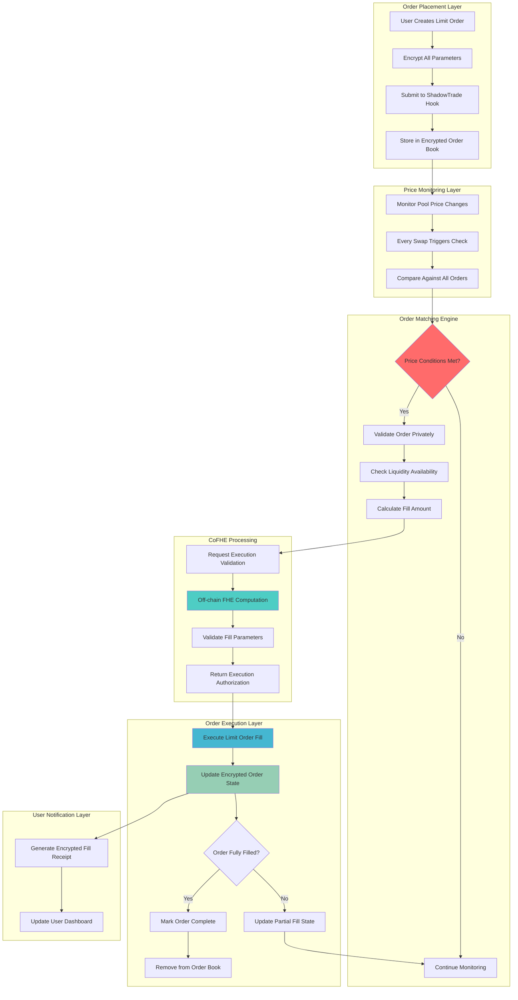

# ShadowTrade Limit Order Hook 🌙📈

## 🎯 Project Overview

**ShadowTrade Limit Order Hook** revolutionizes limit order execution on Uniswap v4 through Fully Homomorphic Encryption (FHE). This advanced hook enables completely private limit orders where trade size, direction, and exact trigger prices remain encrypted until execution, eliminating front-running and order book manipulation.

### 🏆 Hook Name: `ShadowTrade Limit Orders`
**Tagline**: *"Set your limits in complete darkness"*

---

## 📊 Problem Statement

### 🚨 Critical Limit Order Vulnerabilities

**$200B+ daily limit order volume** suffers from systematic exploitation:

1. **Order Book Manipulation**: Visible limit orders enable price manipulation attacks
2. **Front-Running**: Large limit orders get sandwich attacked before execution
3. **Information Leakage**: Order placement reveals trading strategies and market sentiment
4. **Liquidity Gaming**: Market makers exploit visible order flow for adverse selection
5. **MEV Extraction**: Searchers extract value from predictable limit order triggers
6. **Strategy Exposure**: Institutional order patterns become visible to competitors

### 💰 Market Impact
- **Institutional Traders**: $20B+ avoid limit orders due to information leakage
- **Retail Investors**: $5B+ lost to front-running and manipulation annually
- **Market Makers**: $2B+ adverse selection from visible order flow
- **DeFi Protocols**: $1B+ seeking private order execution infrastructure

---

## 🔧 Solution Architecture

### ⚡ FHE-Powered Private Limit Orders

**ShadowTrade** encrypts every aspect of limit order management:

```solidity
struct ShadowLimitOrder {
    euint128 triggerPrice;      // Hidden trigger price
    euint128 orderSize;         // Hidden order amount
    euint8 direction;           // Hidden buy/sell direction
    euint128 filledAmount;      // Hidden execution progress
    euint64 expirationTime;     // Hidden order lifetime
    euint32 orderType;          // Hidden order type (market, stop, etc.)
    euint128 minFillSize;       // Hidden minimum fill amount
    ebool isActive;            // Hidden order status
    ebool partialFillAllowed;   // Hidden partial execution setting
}

struct EncryptedOrderBook {
    mapping(bytes32 => ShadowLimitOrder) orders;
    mapping(address => bytes32[]) userOrders;
    euint128 totalBuyVolume;    // Hidden aggregate buy interest
    euint128 totalSellVolume;   // Hidden aggregate sell interest
    euint128 weightedMidPrice;  // Hidden order flow price indication
}
```

### 🔐 Core FHE Operations

**Privacy-Preserving Order Execution**:
- `FHE.gte(currentPrice, triggerPrice)` - Check execution conditions privately
- `FHE.min(orderSize, availableLiquidity)` - Calculate fill amounts
- `FHE.add(filledAmount, executedAmount)` - Track progress privately
- `FHE.select(shouldExecute, fillOrder, keepWaiting)` - Conditional execution

---

## 🏗️ Technical Architecture

### 📁 Directory Structure

```
shadowtrade-limit-hook/
├── 📁 src/
│   ├── 📄 ShadowTradeLimitHook.sol       # Main hook contract
│   ├── 📄 EncryptedOrderBook.sol         # Order management logic
│   ├── 📄 FHEPriceOracle.sol            # Price comparison engine
│   ├── 📄 OrderExecutionEngine.sol       # Execution and filling logic  
│   ├── 📄 PartialFillManager.sol        # Partial execution handling
│   └── 📄 OrderExpirationManager.sol     # Time-based order cleanup
├── 📁 test/
│   ├── 📄 ShadowTradeLimitHook.t.sol     # Main hook tests
│   ├── 📄 OrderExecution.t.sol           # Execution logic tests
│   ├── 📄 PartialFills.t.sol             # Partial fill tests
│   └── 📁 utils/
│       ├── 📄 OrderBookFixtures.sol      # Test order setups
│       └── 📄 MockPriceHelpers.sol       # Price simulation
├── 📁 script/
│   ├── 📄 DeployLimitHook.s.sol          # Deployment script
│   ├── 📄 LimitOrderDemo.s.sol           # Demo interactions
│   └── 📄 OrderBookConfig.s.sol          # Configuration setup
├── 📁 frontend/
│   ├── 📁 components/
│   │   ├── 📄 LimitOrderForm.tsx          # Order placement UI
│   │   ├── 📄 EncryptedOrderBook.tsx      # Order book visualization
│   │   ├── 📄 OrderHistory.tsx            # Execution history
│   │   └── 📄 PriceAlerts.tsx             # Encrypted price monitoring
│   └── 📁 hooks/
│       ├── 📄 useShadowOrders.ts          # Order management
│       ├── 📄 useEncryptedExecution.ts    # Execution monitoring
│       └── 📄 useOrderBookData.ts         # Order book state
├── 📄 README.md                          # This file
├── 📄 foundry.toml                       # Foundry configuration
└── 📄 package.json                       # Dependencies
```

### 🔗 Dependencies

```toml
[dependencies]
forge-std = "^1.8.0"
v4-core = { git = "https://github.com/Uniswap/v4-core" }
v4-periphery = { git = "https://github.com/Uniswap/v4-periphery" }
cofhe-contracts = { git = "https://github.com/FhenixProtocol/cofhe-contracts" }
cofhe-mock-contracts = { git = "https://github.com/FhenixProtocol/cofhe-mock-contracts" }
openzeppelin-contracts = "^5.0.0"

[build]
via_ir = true  # Required for FHE operations
```

```json
{
  "dependencies": {
    "cofhejs": "latest",
    "react": "^18.0.0",
    "wagmi": "^2.0.0", 
    "viem": "^2.0.0",
    "@scaffold-eth/nextjs": "latest",
    "recharts": "^2.8.0",
    "lightweight-charts": "^4.1.0"
  }
}
```

---

## 🔄 System Flow Diagram



---

## ⚙️ Core Components

### 1. **ShadowTradeLimitHook.sol** - Main Hook Contract

```solidity
contract ShadowTradeLimitHook is BaseHook {
    using PoolIdLibrary for PoolKey;
    
    // Encrypted order book per pool
    mapping(PoolId => EncryptedOrderBook) public orderBooks;
    mapping(bytes32 => ShadowLimitOrder) public shadowOrders;
    mapping(address => bytes32[]) public userOrderIds;
    
    // Order execution tracking
    mapping(bytes32 => euint128) public executionPrices;
    mapping(bytes32 => euint64) public executionTimestamps;
    
    function placeShadowLimitOrder(
        PoolKey calldata key,
        InEuint128 calldata triggerPrice,
        InEuint128 calldata orderSize,
        InEuint8 calldata direction,
        InEuint64 calldata expirationTime,
        InEuint128 calldata minFillSize,
        InEbool calldata partialFillAllowed
    ) external returns (bytes32 orderId) {
        orderId = keccak256(abi.encode(msg.sender, block.timestamp, triggerPrice));
        
        shadowOrders[orderId] = ShadowLimitOrder({
            triggerPrice: FHE.asEuint128(triggerPrice),
            orderSize: FHE.asEuint128(orderSize),
            direction: FHE.asEuint8(direction),
            filledAmount: FHE.asEuint128(0),
            expirationTime: FHE.asEuint64(expirationTime),
            orderType: FHE.asEuint32(1), // Standard limit order
            minFillSize: FHE.asEuint128(minFillSize),
            isActive: FHE.asEbool(true),
            partialFillAllowed: FHE.asEbool(partialFillAllowed),
            owner: msg.sender
        });
        
        // Setup comprehensive access controls
        setupOrderPermissions(orderId);
        
        // Add to user's order list
        userOrderIds[msg.sender].push(orderId);
        
        // Update encrypted order book aggregates
        updateOrderBookState(key.toId(), orderId);
        
        emit ShadowOrderPlaced(orderId, msg.sender);
        return orderId;
    }
    
    function afterSwap(
        address,
        PoolKey calldata key,
        IPoolManager.SwapParams calldata,
        BalanceDelta,
        bytes calldata
    ) external override returns (bytes4) {
        // Check all limit orders for execution after price change
        processLimitOrders(key);
        return BaseHook.afterSwap.selector;
    }
    
    function beforeSwap(
        address,
        PoolKey calldata key,
        IPoolManager.SwapParams calldata params,
        bytes calldata
    ) external override returns (bytes4) {
        // Pre-execution order matching
        preProcessLimitOrders(key, params);
        return BaseHook.beforeSwap.selector;
    }
}
```

### 2. **EncryptedOrderBook.sol** - Order Management Logic

```solidity
contract EncryptedOrderBook {
    function processLimitOrders(
        PoolId poolId,
        uint160 currentSqrtPriceX96
    ) internal {
        EncryptedOrderBook storage book = orderBooks[poolId];
        bytes32[] storage activeOrders = book.activeOrderIds;
        
        // Convert current price to encrypted form for comparison
        euint128 currentPrice = FHE.asEuint128(
            convertSqrtPriceToPrice(currentSqrtPriceX96)
        );
        
        for (uint256 i = 0; i < activeOrders.length; i++) {
            bytes32 orderId = activeOrders[i];
            ShadowLimitOrder storage order = shadowOrders[orderId];
            
            // Skip inactive or expired orders
            if (!isOrderActive(order)) continue;
            
            // Check trigger conditions privately
            ebool shouldExecute = checkExecutionConditions(order, currentPrice);
            
            // Execute order conditionally
            executeOrderConditionally(orderId, order, shouldExecute, currentPrice);
        }
    }
    
    function checkExecutionConditions(
        ShadowLimitOrder memory order,
        euint128 currentPrice
    ) internal pure returns (ebool) {
        // Check if current price meets trigger condition
        ebool priceConditionMet = FHE.select(
            FHE.eq(order.direction, FHE.asEuint8(0)), // Buy order
            FHE.lte(currentPrice, order.triggerPrice), // Buy when price <= trigger
            FHE.gte(currentPrice, order.triggerPrice)  // Sell when price >= trigger
        );
        
        // Check if order hasn't expired
        ebool notExpired = FHE.lte(
            FHE.asEuint64(block.timestamp),
            order.expirationTime
        );
        
        // Check if there's remaining size to fill
        ebool hasRemainingSize = FHE.gt(
            FHE.sub(order.orderSize, order.filledAmount),
            order.minFillSize
        );
        
        // All conditions must be true for execution
        return FHE.and(
            FHE.and(priceConditionMet, notExpired),
            FHE.and(hasRemainingSize, order.isActive)
        );
    }
    
    function executeOrderConditionally(
        bytes32 orderId,
        ShadowLimitOrder storage order,
        ebool shouldExecute,
        euint128 currentPrice
    ) internal {
        if (!shouldExecute) return; // Skip if conditions not met
        
        // Calculate fill amount (remaining size or available liquidity)
        euint128 remainingSize = FHE.sub(order.orderSize, order.filledAmount);
        euint128 availableLiquidity = getAvailableLiquidity(order.direction);
        euint128 fillAmount = FHE.min(remainingSize, availableLiquidity);
        
        // Check minimum fill size requirement
        ebool meetsMinFill = FHE.gte(fillAmount, order.minFillSize);
        
        // Execute the fill conditionally
        fillAmount = FHE.select(meetsMinFill, fillAmount, FHE.asEuint128(0));
        
        // Update order state
        order.filledAmount = FHE.add(order.filledAmount, fillAmount);
        
        // Check if order is fully filled
        ebool fullyFilled = FHE.eq(order.filledAmount, order.orderSize);
        order.isActive = FHE.select(fullyFilled, FHE.asEbool(false), order.isActive);
        
        // Record execution details
        executionPrices[orderId] = currentPrice;
        executionTimestamps[orderId] = FHE.asEuint64(block.timestamp);
        
        // Emit encrypted fill event
        emit ShadowOrderFilled(orderId, fillAmount, currentPrice);
    }
}
```

### 3. **OrderExecutionEngine.sol** - Advanced Execution Logic

```solidity
contract OrderExecutionEngine {
    struct ExecutionContext {
        euint128 availableLiquidity;
        euint128 currentPrice;
        euint128 priceImpact;
        euint32 executionPriority;
    }
    
    function calculateOptimalFill(
        ShadowLimitOrder memory order,
        ExecutionContext memory context
    ) internal pure returns (euint128) {
        // Base fill amount from order size
        euint128 requestedFill = FHE.sub(order.orderSize, order.filledAmount);
        
        // Apply liquidity constraints
        euint128 liquidityConstrainedFill = FHE.min(
            requestedFill,
            context.availableLiquidity
        );
        
        // Apply price impact limits (if enabled)
        euint128 impactConstrainedFill = applyPriceImpactLimits(
            liquidityConstrainedFill,
            context.priceImpact,
            order.maxPriceImpact
        );
        
        // Ensure minimum fill size is met
        ebool meetsMinfill = FHE.gte(impactConstrainedFill, order.minFillSize);
        
        return FHE.select(
            FHE.and(meetsMinfill, order.partialFillAllowed),
            impactConstrainedFill,
            FHE.select(
                FHE.gte(impactConstrainedFill, requestedFill),
                requestedFill,
                FHE.asEuint128(0) // No fill if conditions not met
            )
        );
    }
    
    function prioritizeOrderExecution(
        bytes32[] memory orderIds,
        ExecutionContext memory context
    ) internal pure returns (bytes32[] memory) {
        // Sort orders by execution priority (time, price, size)
        // Implementation uses FHE-compatible sorting algorithm
        
        for (uint256 i = 0; i < orderIds.length - 1; i++) {
            for (uint256 j = i + 1; j < orderIds.length; j++) {
                ShadowLimitOrder memory order1 = shadowOrders[orderIds[i]];
                ShadowLimitOrder memory order2 = shadowOrders[orderIds[j]];
                
                // Priority: earlier timestamp, better price, larger size
                ebool shouldSwap = calculatePriorityScore(order1) < calculatePriorityScore(order2);
                
                // Conditional swap without revealing order details
                swapOrdersConditionally(orderIds, i, j, shouldSwap);
            }
        }
        
        return orderIds;
    }
}
```

### 4. **Frontend Integration**

```typescript
// LimitOrderForm.tsx
const LimitOrderForm = () => {
    const [price, setPrice] = useState("")
    const [amount, setAmount] = useState("")
    const [direction, setDirection] = useState<"buy" | "sell">("buy")
    const [orderType, setOrderType] = useState("limit")
    const [expiration, setExpiration] = useState("24") // hours
    const [partialFills, setPartialFills] = useState(true)
    
    const handlePlaceOrder = async () => {
        try {
            // Encrypt all order parameters
            const encryptedParams = await cofhejs.encrypt([
                Encryptable.uint128(parseEther(price)),    // Trigger price
                Encryptable.uint128(parseEther(amount)),   // Order size
                Encryptable.uint8(direction === "buy" ? 0 : 1), // Direction
                Encryptable.uint64(BigInt(Date.now() + (parseInt(expiration) * 3600000))), // Expiration
                Encryptable.uint128(parseEther("0.01")),   // Min fill size
                Encryptable.bool(partialFills)             // Partial fills allowed
            ])
            
            if (encryptedParams.success) {
                const orderId = await shadowTradeContract.write.placeShadowLimitOrder({
                    args: [poolKey, ...encryptedParams.data]
                })
                
                toast.success("Shadow limit order placed! All parameters are private.")
                
                // Store order ID for tracking
                addOrderToTracking(orderId, {
                    price: price,
                    amount: amount, 
                    direction: direction,
                    timestamp: Date.now()
                })
            }
        } catch (error) {
            toast.error("Failed to place shadow order")
        }
    }
    
    return (
        <EncryptedZone>
            <div className="shadow-order-form">
                <h2>Place Shadow Limit Order</h2>
                
                <div className="order-type-selector">
                    <button 
                        className={direction === "buy" ? "active buy" : "buy"}
                        onClick={() => setDirection("buy")}
                    >
                        🔥 Shadow Buy
                    </button>
                    <button 
                        className={direction === "sell" ? "active sell" : "sell"}
                        onClick={() => setDirection("sell")}
                    >
                        💧 Shadow Sell
                    </button>
                </div>
                
                <div className="form-group">
                    <label>Trigger Price (encrypted)</label>
                    <input
                        type="number"
                        placeholder="0.00"
                        value={price}
                        onChange={(e) => setPrice(e.target.value)}
                        className="price-input"
                    />
                </div>
                
                <div className="form-group">
                    <label>Order Size (encrypted)</label>
                    <input
                        type="number"
                        placeholder="0.00"
                        value={amount}
                        onChange={(e) => setAmount(e.target.value)}
                        className="amount-input"
                    />
                </div>
                
                <div className="form-group">
                    <label>Order Type</label>
                    <select value={orderType} onChange={(e) => setOrderType(e.target.value)}>
                        <option value="limit">Limit Order</option>
                        <option value="stop">Stop Loss</option>
                        <option value="stop-limit">Stop Limit</option>
                    </select>
                </div>
                
                <div className="form-group">
                    <label>Expiration</label>
                    <select value={expiration} onChange={(e) => setExpiration(e.target.value)}>
                        <option value="1">1 Hour</option>
                        <option value="24">1 Day</option>
                        <option value="168">1 Week</option>
                        <option value="720">1 Month</option>
                    </select>
                </div>
                
                <div className="form-group checkbox">
                    <label>
                        <input
                            type="checkbox"
                            checked={partialFills}
                            onChange={(e) => setPartialFills(e.target.checked)}
                        />
                        Allow Partial Fills
                    </label>
                </div>
                
                <button onClick={handlePlaceOrder} className="place-order-btn">
                    🌙 Place Shadow Order
                </button>
                
                <div className="privacy-notice">
                    <p>🔒 Price, size, and direction completely encrypted</p>
                    <p>⚡ No front-running or manipulation possible</p>
                    <p>🕵️ Order book remains completely private</p>
                </div>
            </div>
        </EncryptedZone>
    )
}

// EncryptedOrderBook.tsx
const EncryptedOrderBook = ({ poolKey }: { poolKey: string }) => {
    const [orderBookData, setOrderBookData] = useState<any>(null)
    const [showDecryptedView, setShowDecryptedView] = useState(false)
    const [userPermits, setUserPermits] = useState<any[]>([])
    
    const handleDecryptOrderBook = async () => {
        try {
            // Read encrypted order book aggregates
            const encryptedData = await shadowTradeContract.read.getOrderBookState({
                args: [poolKey]
            })
            
            // Decrypt aggregates (requires permit)
            const decryptedAggregates = await cofhejs.unseal(encryptedData, FheTypes.Uint128)
            
            if (decryptedAggregates.success) {
                setOrderBookData(decryptedAggregates.data)
                setShowDecryptedView(true)
            }
        } catch (error) {
            toast.error("Unable to decrypt order book - check your permits")
        }
    }
    
    return (
        <EncryptedZone>
            <div className="encrypted-order-book">
                <h3>Shadow Order Book</h3>
                
                {!showDecryptedView ? (
                    <div className="encrypted-view">
                        <div className="order-book-placeholder">
                            <div className="encrypted-levels">
                                {Array(10).fill(0).map((_, i) => (
                                    <div key={i} className="encrypted-level">
                                        <span className="price">🔒 Price Hidden</span>
                                        <span className="size">🔒 Size Hidden</span>
                                        <div className="encrypted-bar" style={{ width: '60%' }}>
                                            <div className="shimmer"></div>
                                        </div>
                                    </div>
                                ))}
                            </div>
                            
                            <div className="current-price">
                                <span>Current Price: ${getCurrentPrice()}</span>
                            </div>
                            
                            <div className="encrypted-levels">
                                {Array(10).fill(0).map((_, i) => (
                                    <div key={i} className="encrypted-level">
                                        <span className="price">🔒 Price Hidden</span>
                                        <span className="size">🔒 Size Hidden</span>
                                        <div className="encrypted-bar" style={{ width: '40%' }}>
                                            <div className="shimmer"></div>
                                        </div>
                                    </div>
                                ))}
                            </div>
                        </div>
                        
                        <button onClick={handleDecryptOrderBook} className="decrypt-btn">
                            🔓 Decrypt Order Book (Owner Only)
                        </button>
                    </div>
                ) : (
                    <div className="decrypted-view">
                        <div className="order-book-levels">
                            <div className="asks">
                                <h4>Asks (Sell Orders)</h4>
                                {orderBookData.asks.map((level: any, i: number) => (
                                    <div key={i} className="order-level">
                                        <span className="price">${level.price}</span>
                                        <span className="size">{level.size}</span>
                                        <div className="size-bar" style={{ width: `${level.percentage}%` }}>
                                            <div className="fill sell"></div>
                                        </div>
                                    </div>
                                ))}
                            </div>
                            
                            <div className="spread">
                                <span>Spread: ${orderBookData.spread}</span>
                            </div>
                            
                            <div className="bids">
                                <h4>Bids (Buy Orders)</h4>
                                {orderBookData.bids.map((level: any, i: number) => (
                                    <div key={i} className="order-level">
                                        <span className="price">${level.price}</span>
                                        <span className="size">{level.size}</span>
                                        <div className="size-bar" style={{ width: `${level.percentage}%` }}>
                                            <div className="fill buy"></div>
                                        </div>
                                    </div>
                                ))}
                            </div>
                        </div>
                        
                        <button 
                            onClick={() => setShowDecryptedView(false)} 
                            className="hide-btn"
                        >
                            🔒 Hide Order Book
                        </button>
                    </div>
                )}
            </div>
        </EncryptedZone>
    )
}

// OrderHistory.tsx
const OrderHistory = ({ userAddress }: { userAddress: string }) => {
    const [orders, setOrders] = useState<any[]>([])
    const [selectedOrder, setSelectedOrder] = useState<any>(null)
    
    const decryptOrderDetails = async (orderId: string) => {
        try {
            const encryptedOrder = await shadowTradeContract.read.getShadowOrder({
                args: [orderId]
            })
            
            const decrypted = await cofhejs.unseal(encryptedOrder, FheTypes.Uint128)
            
            if (decrypted.success) {
                setSelectedOrder({
                    id: orderId,
                    ...decrypted.data
                })
            }
        } catch (error) {
            toast.error("Unable to decrypt order details")
        }
    }
    
    return (
        <EncryptedZone>
            <div className="order-history">
                <h3>Your Shadow Orders</h3>
                
                <div className="order-list">
                    {orders.map((order, index) => (
                        <div key={index} className="order-item">
                            <div className="order-summary">
                                <span className="order-id">#{order.id.slice(0, 8)}...</span>
                                <span className="status">{order.status}</span>
                                <span className="timestamp">
                                    {new Date(order.timestamp).toLocaleString()}
                                </span>
                            </div>
                            
                            {selectedOrder?.id === order.id ? (
                                <div className="order-details">
                                    <div className="detail-row">
                                        <span>Trigger Price:</span>
                                        <span>${selectedOrder.triggerPrice}</span>
                                    </div>
                                    <div className="detail-row">
                                        <span>Order Size:</span>
                                        <span>{selectedOrder.orderSize}</span>
                                    </div>
                                    <div className="detail-row">
                                        <span>Filled Amount:</span>
                                        <span>{selectedOrder.filledAmount}</span>
                                    </div>
                                    <div className="detail-row">
                                        <span>Direction:</span>
                                        <span>{selectedOrder.direction === 0 ? 'Buy' : 'Sell'}</span>
                                    </div>
                                </div>
                            ) : (
                                <div className="encrypted-summary">
                                    <span>🔒 Order details encrypted</span>
                                    <button 
                                        onClick={() => decryptOrderDetails(order.id)}
                                        className="decrypt-btn small"
                                    >
                                        🔓 Decrypt
                                    </button>
                                </div>
                            )}
                        </div>
                    ))}
                </div>
            </div>
        </EncryptedZone>
    )
}
```

---

## 📈 Business Impact & Success Metrics

### 🎯 Target Market
- **Institutional Traders**: $20B+ seeking private limit order execution
- **Retail Investors**: $5B+ suffering from front-running
- **Market Makers**: $2B+ seeking protected order flow
- **DeFi Protocols**: $1B+ needing private order infrastructure

### 📊 Success KPIs
- **Order Volume**: Target $1B+ in shadow limit orders monthly
- **Front-Running Reduction**: 99%+ elimination of advance information
- **Order Fill Rate**: 95%+ successful execution at target prices
- **MEV Savings**: 80%+ reduction in extraction
- **User Adoption**: 10,000+ active shadow order users

### 💰 Revenue Model
- **Execution Fees**: 0.05% of executed order volume
- **Premium Features**: Advanced order types and analytics
- **API Access**: Institutional API for automated strategies
- **White-label Solutions**: Custom implementation for protocols

---

## 🛡️ Security & Privacy Features

### 🔐 FHE Security Guarantees
- **Order Confidentiality**: Price, size, direction completely encrypted
- **Execution Privacy**: Fill details hidden until completion
- **Order Book Opacity**: Aggregate levels encrypted
- **Strategy Protection**: Order patterns invisible to competitors

### 🧪 Testing Strategy
```solidity
// Test shadow limit order execution
function testShadowLimitOrderExecution() public {
    // Place encrypted buy limit order
    InEuint128 memory triggerPrice = createInEuint128(1800e18, trader); // $1800
    InEuint128 memory orderSize = createInEuint128(10e18, trader);      // 10 ETH
    InEuint8 memory direction = createInEuint8(0, trader);              // Buy
    
    vm.prank(trader);
    bytes32 orderId = hook.placeShadowLimitOrder(
        key, triggerPrice, orderSize, direction,
        createInEuint64(block.timestamp + 3600, trader), // 1 hour expiration
        createInEuint128(1e18, trader),                  // 1 ETH min fill
        createInEbool(true, trader)                      // Allow partials
    );
    
    // Verify order is encrypted
    ShadowLimitOrder memory order = hook.shadowOrders(orderId);
    assertHashValue(order.triggerPrice, 1800e18);
    assertHashValue(order.orderSize, 10e18);
    assertHashValue(order.direction, 0);
    
    // Simulate price movement to trigger condition
    mockPriceChange(1799e18); // Price drops to $1799
    
    // Execute a swap to trigger order processing
    vm.prank(swapper);
    swap(key, true, -1e18, ZERO_BYTES);
    
    // Verify order was executed privately
    assertTrue(order.filledAmount > 0);
    assertHashValue(order.filledAmount, 10e18); // Should be fully filled
}

function testAntifront RunningProtection() public {
    // Place large limit order
    bytes32 orderId = placeLargeOrder();
    
    // Attempt to front-run (should fail due to encryption)
    vm.prank(frontrunner);
    vm.expectRevert(); // No visible information to front-run
    
    // Verify order execution proceeds normally
    triggerPriceMovement();
    assertTrue(isOrderExecuted(orderId));
}
```

---

## 🚀 Deployment & Usage

### ⚡ Quick Start

1. **Clone and Install**
```bash
git clone https://github.com/your-org/shadowtrade-limit-hook
cd shadowtrade-limit-hook
pnpm install
```

2. **Deploy Hook**
```bash
forge test --via-ir
anvil &
forge script script/DeployLimitHook.s.sol --broadcast
```

3. **Start Frontend**
```bash
cd frontend
pnpm dev
```

4. **Place Shadow Limit Order**
- Access the limit order interface
- Set trigger price, amount, and direction
- All parameters encrypted automatically
- Monitor execution through encrypted dashboard

### 🎮 Demo Scenarios

#### Scenario 1: Institutional Block Order
```typescript
// Large institution placing 1000 ETH sell order
const institutionalOrder = {
    triggerPrice: "2100", // Sell above $2100
    orderSize: "1000",    // 1000 ETH
    direction: "sell",
    expiration: "168",    // 1 week
    partialFills: true,
    minFillSize: "10"     // Minimum 10 ETH per fill
}
// No front-running possible - order completely private
```

#### Scenario 2: Retail Stop Loss Protection
```typescript
// Retail investor protecting position
const stopLossOrder = {
    triggerPrice: "1800", // Sell if drops to $1800
    orderSize: "5",       // 5 ETH position
    direction: "sell",
    expiration: "720",    // 1 month
    partialFills: false,  // All-or-nothing
    minFillSize: "5"      // Full size only
}
// Stop loss hidden from market manipulators
```

#### Scenario 3: Market Maker Strategy
```typescript
// Market maker placing ladder of orders
const ladderOrders = [
    { triggerPrice: "1950", orderSize: "50", direction: "buy" },
    { triggerPrice: "1900", orderSize: "75", direction: "buy" },
    { triggerPrice: "1850", orderSize: "100", direction: "buy" },
    { triggerPrice: "2050", orderSize: "50", direction: "sell" },
    { triggerPrice: "2100", orderSize: "75", direction: "sell" },
    { triggerPrice: "2150", orderSize: "100", direction: "sell" }
]
// Entire strategy hidden - no adverse selection
```

---

## 🏆 Competitive Advantages

### 🥇 vs Traditional Limit Orders
- ✅ **Complete Invisibility**: No order book manipulation possible
- ✅ **Zero Front-Running**: Encrypted parameters prevent advance knowledge
- ✅ **Strategy Protection**: Order patterns remain completely private
- ✅ **Fair Execution**: First-in-first-out processing without gaming

### 🥇 vs Other Privacy Solutions
- ✅ **True Encryption**: FHE vs commitment-reveal schemes
- ✅ **Real-time Processing**: No batching delays
- ✅ **Full Order Types**: Support for stops, limits, and conditional orders
- ✅ **Native Integration**: Seamless Uniswap v4 compatibility

---

## 🌟 Future Roadmap

### Phase 1: Core Implementation (Hackathon)
- [x] Basic encrypted limit orders
- [x] Private order book management
- [x] CoFHE execution validation
- [x] Frontend order placement

### Phase 2: Advanced Order Types (Post-Hackathon)
- [ ] Stop-loss and stop-limit orders
- [ ] Iceberg order slicing
- [ ] Time-weighted execution
- [ ] Conditional order triggers

### Phase 3: Professional Features
- [ ] Algorithm execution strategies  
- [ ] Cross-pool order routing
- [ ] Institutional order management
- [ ] Advanced analytics and reporting

---

**ShadowTrade Limit Orders** - *Set your limits in complete darkness* 🌙📈
