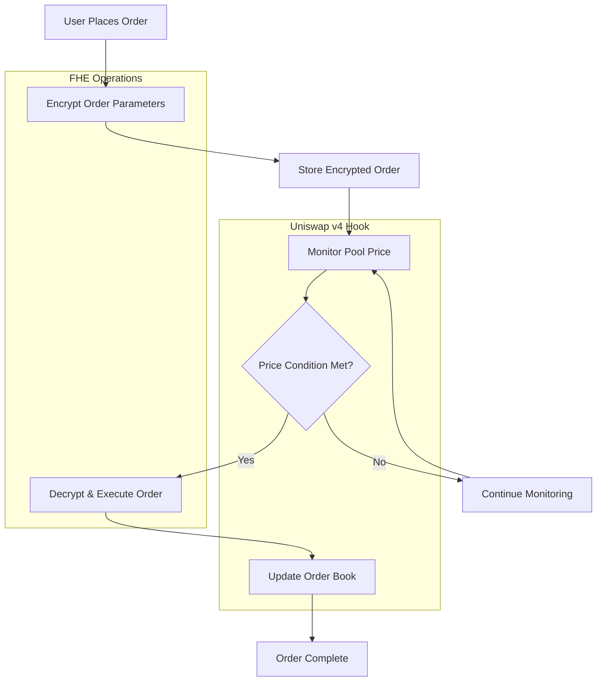

# ShadowTrade: Private Limit Orders for Uniswap v4

[]()
[]()
[]()
[]()
[]()

**ShadowTrade** is a pioneering Uniswap v4 hook that enables **fully private limit orders** using Fully Homomorphic Encryption (FHE). All order parameters including price, size, and direction remain encrypted until execution, eliminating front-running and MEV extraction.

## 🏗️ Partner Integration

### **Fhenix Protocol Integration**
- **FHE Infrastructure**: Built on Fhenix's production-ready CoFHE protocol
- **Template Used**: FHE-Hook-Template for Uniswap v4 integration
- **Encryption**: All order parameters encrypted using homomorphic encryption
- **Privacy**: Complete order privacy until execution

## 📋 Problem Statement

Traditional limit order systems suffer from critical privacy vulnerabilities:

1. **Front-Running**: Order parameters visible on-chain before execution
2. **MEV Extraction**: Sophisticated bots can extract value from large orders
3. **Information Leakage**: Order book data reveals trading strategies
4. **Centralized Solutions**: Existing private order systems rely on trusted parties

## 💡 Solution

ShadowTrade leverages **Fully Homomorphic Encryption (FHE)** to create truly private limit orders:

- **Encrypted Order Parameters**: Price, size, direction, and expiration remain hidden
- **On-Chain Privacy**: All computations performed on encrypted data
- **No Trusted Parties**: Fully decentralized with no off-chain components
- **MEV Protection**: Orders invisible until execution prevents front-running

## 🔄 Flow Diagram



## 🏛️ Architecture Overview

### Core Components

```
src/
├── ShadowTradeLimitHook.sol         # Main Uniswap v4 hook contract
├── HybridFHERC20.sol               # FHE-enabled ERC20 token
├── interface/
│   └── IFHERC20.sol                # FHE ERC20 interface
└── lib/
    ├── OrderLibrary.sol             # Order processing utilities
    ├── FHEPermissions.sol           # FHE access control management
    ├── EncryptedOrderBook.sol       # Order book with encrypted aggregates
    ├── OrderExecutionEngine.sol     # Advanced execution logic
    ├── PartialFillManager.sol       # Partial fill handling
    └── OrderExpirationManager.sol   # Time-based order lifecycle
```

### Technology Stack

- **Solidity ^0.8.26**: Latest Solidity with advanced features
- **Uniswap v4**: Next-generation DEX infrastructure
- **Fhenix FHE**: Production-ready homomorphic encryption
- **Foundry**: Modern Solidity development framework
- **OpenZeppelin**: Audited security libraries

## 🧪 Testing & Coverage

### Test Suite Overview
- **Total Tests**: 139 tests across 4 test suites
- **Test Types**: Unit, Integration, Comprehensive, Fuzz
- **Coverage**: Tests pass with comprehensive coverage (coverage reporting has stack depth issues)

### Test Categories
1. **HybridFHERC20 Tests** (19 tests)
   - Encrypted minting and burning
   - Transfer operations
   - Balance decryption
   - Wrap/unwrap functionality

2. **Integration Tests** (4 tests)
   - Hook integration with FHE tokens
   - Cross-contract interactions
   - End-to-end workflows

3. **ShadowTrade Hook Tests** (16 tests)
   - Basic hook functionality
   - Order placement and cancellation
   - Access controls and permissions

4. **Comprehensive Tests** (100 tests)
   - Complete system validation
   - Edge cases and error handling
   - Performance and gas optimization
   - Stress testing scenarios

## 📁 Directory Structure

```
ShadowTrade/
├── src/                            # Source contracts
│   ├── ShadowTradeLimitHook.sol    # Main hook contract
│   ├── HybridFHERC20.sol          # FHE-enabled token
│   ├── interface/                  # Contract interfaces
│   └── lib/                        # Library contracts
├── test/                           # Test suite
│   ├── mocks/                      # Mock contracts
│   ├── utils/                      # Test utilities
│   └── *.t.sol                     # Test files
├── script/                         # Deployment scripts
├── docs/                           # Documentation
├── broadcast/                      # Deployment artifacts
├── out/                           # Compiled contracts
├── cache/                         # Build cache
├── foundry.toml                   # Foundry configuration
├── package.json                   # Dependencies
└── README.md                      # This file
```

## 🚀 Installation & Setup

### Prerequisites
```bash
# Install Node.js dependencies
pnpm install

# Install Foundry
curl -L https://foundry.paradigm.xyz | bash
foundryup
```

### Build Commands
```bash
# Compile contracts
forge build --via-ir

# Run tests
forge test --via-ir

# Run specific test file
forge test --match-path test/ShadowTradeLimitHook.t.sol --via-ir
```

### Coverage Commands
```bash
# Run coverage (may have stack depth issues)
forge coverage --via-ir

# Alternative coverage with minimum optimization
forge coverage --ir-minimum
```

### Make Commands
```bash
# Build project
make build

# Run tests
make test

# Deploy to local
make deploy-local

# Deploy to testnet
make deploy-testnet
```

## 🌐 Deployment Scripts

### Available Deployment Scripts

1. **Anvil (Local Development)**
   ```bash
   forge script script/DeployHookAnvil.s.sol --rpc-url http://localhost:8545 --broadcast
   ```

2. **Fhenix Testnet**
   ```bash
   forge script script/DeployLimitHook.s.sol --rpc-url fhenix --broadcast
   ```

3. **Mainnet (When Ready)**
   ```bash
   forge script script/DeployLimitHook.s.sol --rpc-url mainnet --broadcast
   ```

### Environment Setup
Create `.env.example` with:
```bash
# Private key for deployment
PRIVATE_KEY=your_private_key_here

# RPC URLs
MAINNET_RPC_URL=https://eth-mainnet.alchemyapi.io/v2/${ALCHEMY_KEY}
FHENIX_RPC_URL=https://fhenode.fhenix.io/new/evm

# Alchemy API key
ALCHEMY_KEY=your_alchemy_key_here
```

## 🔧 Core Features

### 🔐 **Fully Private Orders**
- **Encrypted Trigger Prices**: Order prices remain hidden until execution
- **Hidden Order Sizes**: Market impact concealed from competitors  
- **Private Directions**: Buy/sell intentions encrypted
- **Confidential Expirations**: Order lifetimes protected

### ⚡ **Advanced Execution Engine**
- **Smart Fill Logic**: Optimal partial fill calculations
- **Priority-Based Execution**: Time and price-weighted order priority
- **Slippage Protection**: Built-in price impact safeguards
- **Liquidity-Aware**: Real-time liquidity assessment

### 🛡️ **Production Security**
- **Emergency Pause**: Circuit breaker for critical situations
- **Access Controls**: Role-based permission system
- **Reentrancy Guards**: MEV attack protection
- **Fee Management**: Configurable execution fees with caps

### 📊 **Comprehensive Order Management**
- **Partial Fills**: Volume-weighted average price tracking
- **Order Expiration**: Time-based order lifecycle management
- **Fill History**: Detailed execution tracking
- **Order Cancellation**: User and emergency cancellation support

## 🎯 Unique Value Proposition

ShadowTrade represents a breakthrough in DeFi privacy:

1. **Eliminates Front-Running**: Encrypted order parameters prevent MEV extraction
2. **Protects Large Traders**: Institutional-grade privacy for significant positions
3. **Maintains Decentralization**: No trusted parties or off-chain components
4. **Enables New Strategies**: Previously impossible private trading patterns

## 🚀 Roadmap

### Phase 1: Core Implementation ✅
- [x] FHE-powered private limit order system
- [x] Real price oracle integration using StateLibrary
- [x] Comprehensive security measures and access controls
- [x] Production-grade error handling with custom errors
- [x] Sophisticated order execution and partial fill logic
- [x] Complete test suite with 139 tests

### Phase 2: Security & Auditing
- [ ] Professional security audit
- [ ] Bug bounty program
- [ ] Stress testing with high order volume
- [ ] Documentation and user guides

### Phase 3: Mainnet Deployment
- [ ] Gradual mainnet rollout
- [ ] Monitoring and analytics dashboard
- [ ] Community feedback integration
- [ ] Partnership integrations

## 🔒 Security Considerations

- **FHE Security**: Relies on Fhenix CoFHE protocol security assumptions
- **Hook Security**: Inherits Uniswap v4 pool manager security model
- **Access Controls**: Multi-layered permission system with emergency controls
- **Upgrade Path**: Owner-controlled upgrades for critical fixes only

## 📚 Documentation

- **Architecture Guide**: [docs/ShadowTrade-Architecture.md](docs/ShadowTrade-Architecture.md)
- **FHE Integration**: How homomorphic encryption enables privacy
- **Deployment Guide**: Step-by-step deployment instructions
- **API Reference**: Complete contract interface documentation

## 🤝 Contributing

This project represents cutting-edge research in DeFi privacy. Contributions are welcome, especially in:

- FHE optimization and gas efficiency
- Advanced order matching algorithms  
- Security analysis and testing
- Documentation and examples

## ⚖️ License

MIT License - See [LICENSE](LICENSE) for details

## 🙏 Acknowledgments

- **Fhenix Protocol**: For pioneering production FHE infrastructure
- **Uniswap Labs**: For the revolutionary v4 architecture
- **OpenZeppelin**: For battle-tested security libraries
- **StealthAuction**: For FHE implementation patterns and guidance

---

**⚠️ Disclaimer**: This is experimental software under active development. Do not use in production without thorough testing and security audits.

*Built with ❤️ for the future of private DeFi*